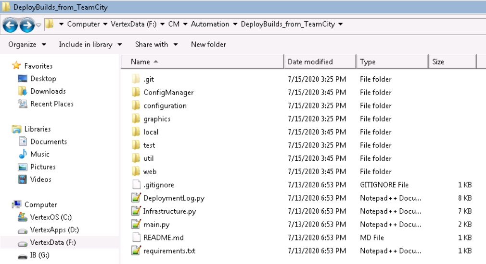
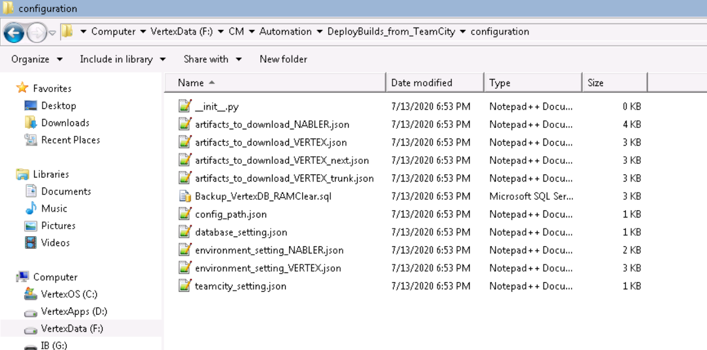

# ControllerSetup_from_TeamCity
Download and create package from team city and also do some housekeeping task

## Using Python framework
Pre-requisite: Need active internet connection to Aristocrat network. Since have to download builds from TeamCity

* Create a folder since here we will place all our requisite contents
* For this example, I have created a folder in environment at location F:\CM\Automation 
* Create another folder DeployBuilds_from_TeamCity or checkout the repository
* 
* To run the framework
Open Command Prompt and navigate to the root F:\CM\Automation\DeployBuilds_from_TeamCity
* Navigate to root of framework
    ```cmd
    cd /d F:\CM\Automation\DeployBuilds_from_TeamCity
    ```
* Typing the following command and hit ENTER (ONLY ONCE)
Installation of these requirements are only done once, as part of python setup. Mentioned it here for ease of access.
    ```cmd
    pip install .
    ```
* Typing the following command and hit ENTER
    ```cmd
    python main.py
    ```
* The python framework work based on Json configuration files and part of the download 
* These configs are placed in folder F:\CM\Automation\DeployBuilds_from_TeamCity\configuration

## Configurations
The python framework work based on Json configuration files and part of the download 
* These configs are placed in directory DeployBuilds_from_TeamCity\configuration
* 
* Sample master config file config_path.json
    ```javascript
        {
          "_comment": "configuration for TeamCity server",
          "host": "http://uslv-addv12-02.dev.local/",
          "teamcity_username": "guest",
          "teamcity_password": "guest",
          "api_artifacts": "/httpAuth/app/rest/builds/id:{0}/artifacts/children",
          "api_buildId_without_tags": "/httpAuth/app/rest/builds/buildType:{0},status:success",
          "api_buildId_with_tags": "/httpAuth/app/rest/builds/buildType:{0},status:success,tags:({1})"
        }
    ```

* User has to ensure these four configurations files are based on thier requirement and setup

    * artifacts_to_download: Configuration information related to Vertex/NAbler or any other artifact information as per need.
        * Information of which build ID and tags (if supplied) to use from TeamCity
        * Where to replace the artifacts in the setup
        * What sort of configuration files are present, and needs to be copied to any specific location
        * Value is path of the config file. E.g. "configuration/artifacts_to_download_VERTEX.json"
        * Application details for Vertex
            ```javascript
            {
              "_comment": "Vertex artifacts to download and replace",
                "Service": {
                    "folder_name": "Service",
                    "config_file_name": "Controller.config",
                    "buildTypeID": "Vertex_VertexNext",
                    "tags": null,
                    "anchor": "Applications/Aristocrat.Vertex.Service",
                    "copy_artifacts_to_path": [
                      "D:\\Service"
                    ],
                    "copy_config_to_path": [
                      "D:\\Backup\\Configurations",
                      "F:\\Configurations"
                    ]
                  },
                  "SQL": {
                    "folder_name": "SQL",
                    "config_file_name": null,
                    "buildTypeID": "Vertex_VertexNext",
                    "tags": null,
                    "anchor": "SQL",
                    "copy_artifacts_to_path": null,
                    "copy_config_to_path": null
                  }
            }
            ```
    * environment_setting: Environment specific information 
        * Information related to what file extensions to be ignored while downloading. 
        * Windows processes to terminate, to not cause issue when deleted old artifacts and copying downloaded artifacts
        * Which database to setup, and additional setting, if required.
        * Configuration files to modified for test environment. 
        * Value is path of the config file. E.g. "configuration/environment_setting_VERTEX.json"
        * Environment details for Vertex Expand source
            ```javascript
            {
              "_comment": "configuration for controller box",
              "exclude_file_extension": [
                ".pdb"
              ],
              "windows_process_to_stop": [
                "VertexShell.exe",
                "Aristocrat.Vertex.Service.exe"
              ],
              "download_artifact_root_path": "F:\\Artifacts",
              "artifact_config_folder": "Configurations",
              "db_to_setup": {
                "db_script": "Vertex_and_Games_on_VertexBox.sql",
                "db_to_delete": [
                  "Vertex",
                  "VertexArch",
                  "GamesArch",
                  "Games",
                  "Misc"
                ],
                "db_script_mod": {
                  "db_size": {
                    "mod": "no",
                    "original_size": "10240MB",
                    "new_size": "40MB"
                  },
                  "find_replace": {
                    "mod": "no",
                    "find_text": [
                      "VertexXYZ",
                      "GamesXYZ",
                      "MiscXYZ"
                    ],
                    "replace_text": [
                      "Vertex",
                      "Games",
                      "Misc"
                    ]
                  }
                }
              },
              "modify_config": {
                "Shell": {
                  "config_name": "Shell.config",
                  "config_path": "F:\\Artifacts\\Configurations",
                  "attributes": {
                    "setting_1": {
                      "xpath": ".//fileNameConstraints[@enabled='true']",
                      "tag": "fileNameConstraints",
                      "attribute": {
                        "enabled": "false"
                      }
                    }
                  }
                },
                "Valyria": {
                  "config_name": "Valyria.config",
                  "config_path": "F:\\Artifacts\\Configurations",
                  "attributes": {
                    "setting_1": {
                      "xpath": ".//appSettings",
                      "tag": "add",
                      "attribute": {
                        "key": "QuixantDoorPin",
                        "value": "Pin7"
                      }
                    },
                    "setting_2": {
                      "xpath": ".//appSettings/add[@key='PowerBackup']",
                      "tag": "add",
                      "attribute": {
                        "value": ""
                      }
                    }
                  }
                }
              },
              "sql_scripts_run": "configuration/Backup_VertexDB_RAMClear.sql",
              "cleanup_directories": [
                [
                  "F:\\Logs",
                  [
                    "Valyria.log",
                    "AuthenticationConsole.log"
                  ]
                ],
                [
                  "F:\\MSSQL\\Backup\\DB"
                ]
              ]
            }
            ```
    * database_setting: 
        * Database server and connection details for environment
        * Value is path of the config file. E.g. "configuration/database_setting.json"
        * Database connection details for Vertex
            ```javascript
            {
              "_comment": "Configuration for controller (local) database server",
              "db_server": "localhost\\SQLEXPRESS",
              "db_username": "sa",
              "db_password": "Password1"
            }
            ```        
    * teamcity_setting:
        * TeamCity server and connection details
        * Value is path of the config file. E.g. "configuration/teamcity_setting.json"
        * teamcity connection details for Vertex
            ```javascript
            {
              "_comment": "configuration for TeamCity server",
              "host": "http://uslv-addv12-02.dev.local/",
              "teamcity_username": "guest",
              "teamcity_password": "guest",
              "api_artifacts": "/httpAuth/app/rest/builds/id:{0}/artifacts/children",
              "api_buildId_without_tags": "/httpAuth/app/rest/builds/buildType:{0},status:success",
              "api_buildId_with_tags": "/httpAuth/app/rest/builds/buildType:{0},status:success,tags:({1})"
            }
            ``` 

### Note
    * This is a one time activity, unless any update in Python framework. Frequency of update will be less
    * User should have to maintain/modify configuration files
    * NAbler and Vertex samples are already created
    * Vertex has two sample:
        * Trunk artifacts_to_download_VERTEX_trunk.json
        * Next artifacts_to_download_VERTEX_next.json