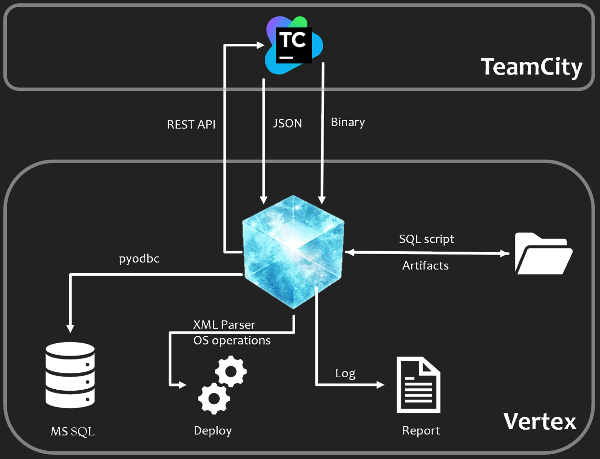

Overview
=========

	
This diagram  shows the overall working of the framework. 
Can be used to setup any envoironment, based on need and changes in configuration file, without changing the code. 
Offcourse code change is required for feature enhancement or bug fixes.

Working
-------

#. Pick details from json config files, such as
	* TeamCity url and credentials
	* Database connection and credentials
	* Applications to download and their location information
	* What database to wipe and which script to use to setup new db.
#. Once the Tesserat (application) starts. it will perform the following
	* Download the requisite builds from TeamCity
	* Save the downloaded builds to the environment
	* Start deleting the previous artifacts and replace with downloaded builds
	* Drop exisitng database and recreate new database
	* Make changes in Controller config, as per requirement.
#. Post completion of tasks
	* Generate and save report. 	
	* Add timestamp to the name of the report. E.g. *BuildDeploymentInfo_<timestamp>.log*
		* Build download status
		* Build replacement status
		* Database script used
	* Cleanup task